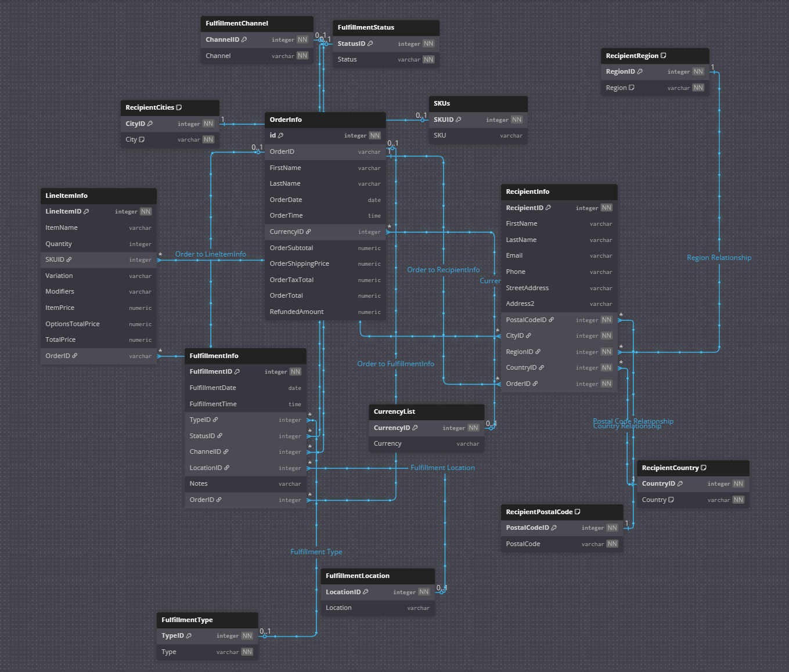

# Over View for Sales Database

## Square data tables



## Shopify data tables
COMING SOON

## DBML

### Rough Template 12-18-2025
```dbml


// Square tables rough template

Table SQUARERecipientInfo [headercolor: #177a5e] {
	RecipientID integer [ pk, increment, not null, unique ]
	FirstName varchar
	LastName varchar
	Email varchar
	Phone varchar
	StreetAddress varchar
	Address2 varchar
	PostalCodeID integer [ not null ]
	CityID integer [ not null ]
	RegionID integer [ not null ]
	CountryID integer [ not null ]
	OrderID integer [ not null ]
}

Table SQUARERecipientCities [headercolor: #177a5e] {
	CityID integer [ pk, increment, not null, unique ]
	City varchar [ not null, note: 'Before loading the data make sure that all entries have the same cap sensitive structure' ]

	Note: '''This table will hold a list of all cities that have been delivered to. 

(eventually want to add longitude and latitude to this)'''
}

Table SQUARERecipientRegion [headercolor: #177a5e] {
	RegionID integer [ pk, increment, not null, unique ]
	Region varchar [ not null, note: 'When processing the data make sure to normalize all states in the US to their 2 letter abbreviation' ]

	Note: 'This will hold the states for shipments within the united states but will also hold regions around the world for location outside of the US.'
}

Table SQUARERecipientCountry [headercolor: #177a5e] {
	CountryID integer [ pk, increment, not null, unique ]
	Country varchar [ not null, note: 'Country should be in the country code, but do a double check to make sure. ' ]

	Note: 'This table will hold all of the information relating to the countries that have been shipped to.'
}

Table SQUARERecipientPostalCode [headercolor: #177a5e] {
	PostalCodeID integer [ pk, increment, not null, unique ]
	PostalCode varchar [ not null ]

	Note: 'This will hold all of the postal codes that have been shipped to'
}

Table SQUAREFulfillmentInfo [headercolor: #c9a30a] {
	FulfillmentID integer [ pk, increment, not null, unique ]
	FulfillmentDate date
	FulfillmentTime time
	TypeID integer
	StatusID integer
	ChannelID integer
	LocationID integer
	Notes varchar
	OrderID integer
}

Table SQUAREFulfillmentType [headercolor: #c9a30a] {
	TypeID integer [ pk, increment, not null, unique ]
	Type varchar [ not null ]
}

Table SQUAREFulfillmentStatus [headercolor: #c9a30a] {
	StatusID integer [ pk, increment, not null, unique ]
	Status varchar [ not null ]
}

Table SQUAREFulfillmentChannel [headercolor: #c9a30a] {
	ChannelID integer [ pk, increment, not null, unique ]
	Channel varchar [ not null ]
}

Table SQUAREFulfillmentLocation [headercolor: #c9a30a] {
	LocationID integer [ pk, increment, not null, unique ]
	Location varchar
}

Table SQUAREOrderInfo [headercolor: #4a177a] {
	id integer [ pk, increment, not null, unique ]
	OrderID varchar
	FirstName varchar
	LastName varchar
	OrderDate date
	OrderTime time
	CurrencyID integer
	OrderSubtotal numeric
	OrderShippingPrice numeric
	OrderTaxTotal numeric
	OrderTotal numeric
	RefundedAmount numeric
}

Table SQUARECurrencyList [headercolor: #4a177a] {
	CurrencyID integer [ pk, increment, not null, unique ]
	Currency varchar
}

Table SQUARELineItemInfo [headercolor: #175e7a] {
	LineItemID integer [ pk, increment, not null, unique ]
	ItemName varchar
	Quantity integer
	SKUID integer
	Variation varchar
	Modifiers varchar
	ItemPrice numeric
	OptionsTotalPrice numeric
	TotalPrice numeric
	OrderID varchar
}

Table SKUs [headercolor: #175e7a] {
  SKUID integer [pk, increment, not null, unique]
  SKU varchar
}


// Shopify tables rough template
table SHOPIFYShippingInfo [headercolor: #FFFFFF]{
  ShippingId integer
  ORDERID integer
  ShippingName varchar
  ShippingStreet varchar 
  ShippingAddress1 varchar
  ShippingAddress2 varchar
  ShippingCompany varchar
  ShippingCity varchar
  ShippingZip varchar 
  ShippingProvince varchar
  ShippingProvinceName varchar
  ShippingCountry varchar
  ShippingPhone varchar
  ShippingMethod  varchar 
}

table SHOPIFYBillingInfo [headercolor: #FFFFFF] {
  BllingId integer
  ORDERID integer
  BillingName varchar
  BillingStreet varchar 
  BillingAddress1 varchar
  BillingAddress2 varchar
  BillingCompany varchar
  BillingCity varchar
  BillingZip varchar 
  BillingProvince varchar
  billingProvinceName varchar
  BillingCountry varchar
  BillingPhone varchar
}

table SHOPIFYLineItemInfo [headercolor: #FFFFFF] {
  id integer
  ORDERID varchar
  LineitemQuantity integer
  LineitemName varchar
  LineitemPrice numeric 
  LineitemCompareAtPrice numeric
  LineitemSku varhcar
  LineitemRequiresShipping bool
  LineitemTaxable bool
  LineitemFulfillmentStatus varchar
  LineitemDiscount numeric
}

table SHOPIFYOrderInfo [headercolor: #FFFFFF] {
  ID integer
  NameORDERID varchar
  Email varchar 
  FinancialStatus varchar
  PaidAtDate date
  PaidAtTimestamp timestamp
  FulfillmentStatus varchar
  FulfilledAtDate date
  FilfilledAtTimestamp timestamp
  AcceptsMarketing char[10]
  Currency char[5]
  Subtotal numeric
  Shipping numeric
  Taxes numeric
  Total numeric
  DiscountCode varchar
  DiscountAmount numeric
  CreatedAtDate date
  CreatedAtTimestamp timestamp


}

table SHOPIFYPeymentInfo [headercolor: #FFFFFF] {
  ID integer
}

// refrences

// Initial square refrences 12-16-2025

Ref "City Relationship" {
	SQUARERecipientCities.CityID < SQUARERecipientInfo.CityID [ delete: no action, update: cascade ]
}


Ref "Region Relationship" {
	SQUARERecipientInfo.RegionID > SQUARERecipientRegion.RegionID [ delete: no action, update: no action ]
}

Ref "Postal Code Relationship" {
	SQUARERecipientPostalCode.PostalCodeID < SQUARERecipientInfo.PostalCodeID [ delete: no action, update: no action ]
}

Ref "Country Relationship" {
	SQUARERecipientInfo.CountryID > SQUARERecipientCountry.CountryID [ delete: no action, update: no action ]
}

Ref "Fulfillment Type" {
	SQUAREFulfillmentType.TypeID < SQUAREFulfillmentInfo.TypeID [ delete: no action, update: no action ]
}

Ref "Fulfillment Status" {
	SQUAREFulfillmentInfo.StatusID > SQUAREFulfillmentStatus.StatusID [ delete: no action, update: no action ]
}

Ref "Filfillment Channel" {
	SQUAREFulfillmentChannel.ChannelID < SQUAREFulfillmentInfo.ChannelID [ delete: no action, update: no action ]
}

Ref "Fulfillment Location" {
	SQUAREFulfillmentInfo.LocationID > SQUAREFulfillmentLocation.LocationID [ delete: no action, update: no action ]
}

Ref "Currency" {
	SQUAREOrderInfo.CurrencyID > SQUARECurrencyList.CurrencyID [ delete: no action, update: no action ]
}

Ref "SKU"{
  SQUARELineItemInfo.SKUID > SKUs.SKUID [ delete: no action, update: no action]
}

ref "Order to FulfillmentInfo" {
  SQUAREFulfillmentInfo.OrderID > SQUAREOrderInfo.OrderID [ delete: no action, update: no action]
}

ref "Order to LineItemInfo" {
  SQUARELineItemInfo.OrderID > SQUAREOrderInfo.OrderID [ delete: no action, update: no action]
}

ref "Order to RecipientInfo" {
  SQUARERecipientInfo.OrderID > SQUAREOrderInfo.OrderID [ delete: no action, update: no action]
}

// Initial shopify refrences 12-16-2025
```